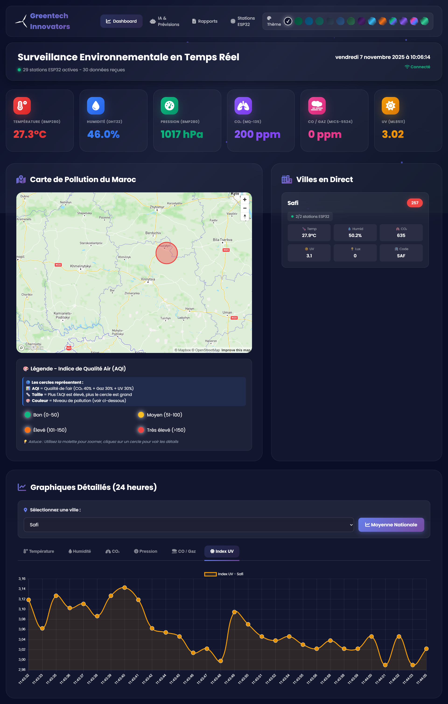

# GreenTech Innovators

## Aperçu

GreenTech Innovators est une plateforme de suivi de changement climatique qui combine un backend Spring Boot, un tableau de bord React temps réel et un firmware IoT pour capteurs environnementaux. Le projet vise à centraliser la collecte de données issues des stations, analyser les tendances (y compris via un module d'IA) et présenter des visualisations interactives pour les décideurs ou les opérateurs de villes intelligentes.

## Architecture globale

- **Backend (`backend/`)** : API REST Spring Boot 3 connectée à MongoDB, WebSocket STOMP pour la diffusion temps réel, génération CSV/PDF et analyses Vertex AI.
- **Frontend (`frontend/`)** : SPA React + Vite, intégrations Mapbox/Leaflet, graphiques Chart.js et websocket client pour la télémétrie live.
- **IoT (`backend/iot/`)** : Firmware ESP32 (PlatformIO) pour capteurs BME280, MQ-6 et ML8511, publication STOMP vers le backend et affichage OLED embarqué.
- **Data & Reporting** : Stockage MongoDB, planification (`Schedule`, `WeeklyReportScheduler`) pour produire rapports CSV/PDF enrichis par IA (iText + Vertex AI / OpenAI).

## Principales fonctionnalités

- **Gestion des entités** : CRUD complet pour villes, stations, données capteurs et prédictions (`CityController`, `StationController`, `dataController`, `PredictionController`).
- **Temps réel** : WebSocket STOMP (`/ws-native`, `DataWebSocketController`) pour diffuser les nouvelles mesures aux clients connectés.
- **Analytique & IA** : KPIs pré-calculés, précision hebdomadaire des modèles, génération et analyse de rapports via `WeeklyReportService` (CSV + PDF avec synthèse IA).
- **Tableau de bord interactif** : Carte dynamique (`MapView`), cartes de villes, graphiques de tendance (`SensorChart`, `AccuracyChart`) et indicateurs en direct (`StatCard`).
- **Monitoring IoT** : Envoi de télémétrie JSON depuis ESP32 (température, humidité, pression, CO₂, gaz, UV) avec visualisation embarquée sur écran OLED.

## Pile technologique

| Domaine        | Technologies clés                                                                                                                       |
| -------------- | --------------------------------------------------------------------------------------------------------------------------------------- |
| Backend        | Java 17, Spring Boot 3, Spring Data MongoDB, Spring WebSocket, SpringDoc OpenAPI, Reactor, iText 7, Spring AI (OpenAI/Vertex AI), Maven |
| Frontend       | React 18, Vite 5, Axios, Chart.js 4, Leaflet, Mapbox GL, React-Leaflet, STOMP.js, SockJS                                                |
| IoT            | ESP32, PlatformIO, ArduinoJson, Adafruit BME280/SSD1306, WebSocketsClient                                                               |
| Infrastructure | MongoDB, WebSocket/STOMP, PDF/CSV reporting                                                                                             |

## Démarrage rapide

### Prérequis

- Java 17 et Maven Wrapper (`backend/mvnw`)
- Node.js ≥ 18 (ou 20 LTS recommandé) et npm/pnpm
- MongoDB en local ou hébergé (URI configurable)
- Clés API Vertex AI / OpenAI stockées hors dépôt (variables d'environnement ou fichiers protégés)

### Lancer le backend

```bash
cd backend
# Créez ou mettez à jour src\main\resources\application.properties avec vos identifiants MongoDB et clés API
./mvnw spring-boot:run
```

Endpoints principaux :

- REST : `http://localhost:8080/api/cities`, `/api/stations`, `/api/data`, `/api/predictions`, `/api/reports`
- WebSocket STOMP : `ws://localhost:8080/ws-native` (destination `/app/addData`, topic `/topic/data`)
- Documentation OpenAPI : `http://localhost:8080/swagger-ui.html`

### Lancer le frontend

```bash
cd frontend
npm install  # ou pnpm install
npm run dev
```

Le tableau de bord est accessible sur `http://localhost:5173` (port Vite par défaut).

### Firmware IoT (optionnel)

```bash
cd backend/iot
pio init --ide "vscode" --board esp32dev  # si nécessaire
pio run --target upload
```

Configurez le SSID, le mot de passe Wi-Fi et l'adresse du backend dans `config.h` avant le flash.

## Structure du dépôt

```
GreenTech-Innovators/
├─ backend/
│  ├─ src/main/java/com/greentechinnovators/...  # API REST, services, WebSocket, reporting
│  ├─ src/main/resources/application.properties   # Configuration Spring Boot (à sécuriser)
│  ├─ iot/                                        # Firmware ESP32 (PlatformIO)
│  └─ reports/                                    # Rapports hebdomadaires générés (CSV, PDF)
├─ frontend/
│  ├─ src/                                        # Pages React, composants, contexte WebSocket
│   front existante
│  └─ vite.config.js                               # Configuration Vite + alias
└─ README.md                                      # Ce document
```

## Bonnes pratiques & prochaines étapes

- Externalisez les secrets (`application.properties`, clés Vertex/OpenAI) via variables d'environnement ou coffre-fort.
- Ajoutez des tests unitaires/integration (JUnit, React Testing Library) pour sécuriser les flux critiques.
- Automatisez l'exécution des rapports hebdomadaires via le scheduler Spring (`WeeklyReportScheduler`).
- Activez un reverse proxy (Nginx) ou une plateforme cloud pour déployer les services.
- Consultez `frontend/STRUCTURE.md` et `frontend/DEMARRAGE.md` pour des guides détaillés côté client.

## UI frontend




